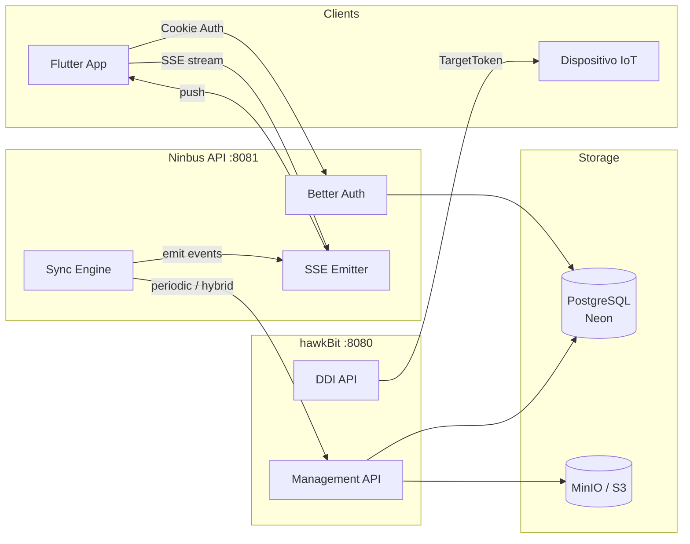
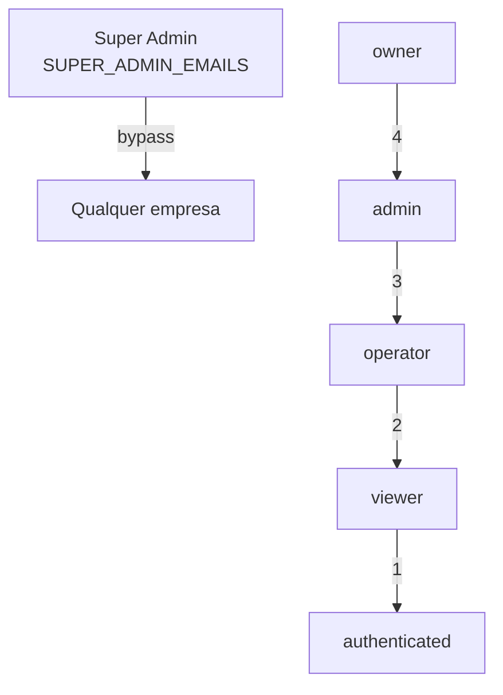
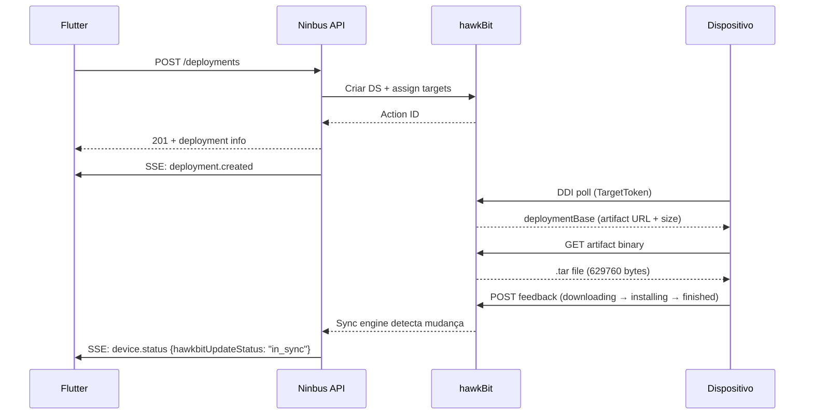
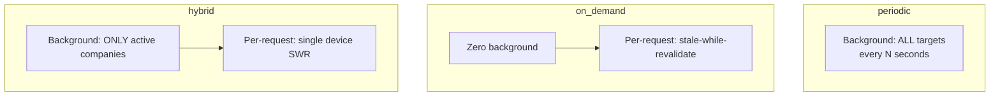
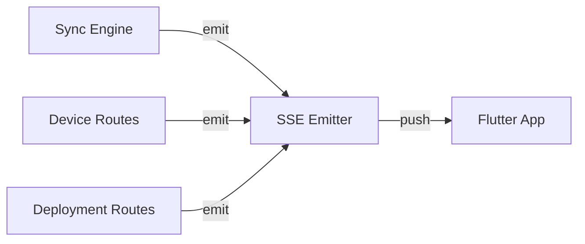
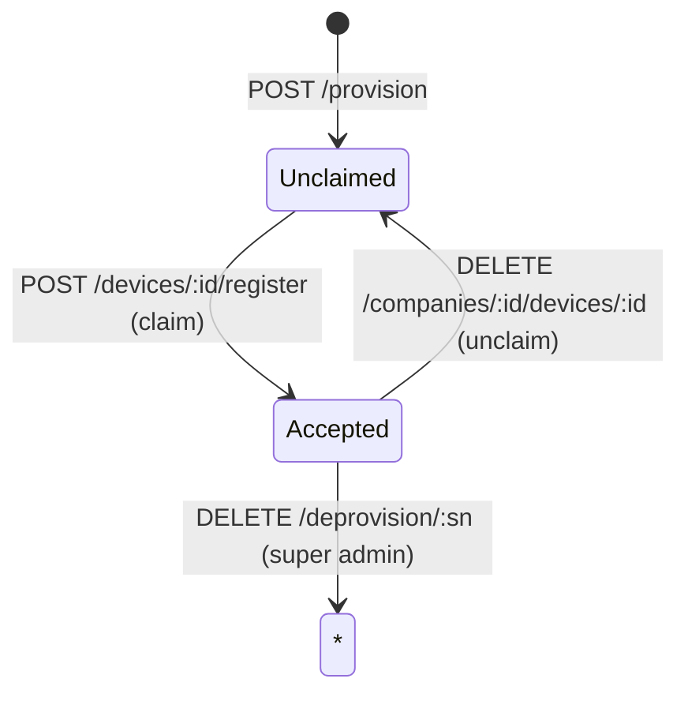

# Ninbus API

Plataforma OTA para gerenciamento de frotas IoT — provisioning, firmware upload, deployment e monitoramento em tempo real.

**Stack:** Bun · Elysia · Better Auth · Drizzle ORM · Eclipse hawkBit 1.0.3

---

## Arquitetura



**Fluxo de dados:**

1. **Flutter** → Ninbus API (cookie auth) → hawkBit Management API (Basic Auth)
2. **Sync Engine** → hawkBit → DB local (background) → SSE → Flutter (real-time)
3. **Dispositivo** → hawkBit DDI (TargetToken) → download firmware → feedback

---

## Quick Start

```bash
# Local development
bun install
cp .env.example .env          # fill required values
bun run db:push
bun run dev                    # → http://localhost:8081

# Docker (API + hawkBit + MinIO)
docker compose build
docker compose up -d
docker compose logs -f api

# Tests (separate .env.test DB)
bun test --env-file=.env.test
```

---

## Serviços Docker

| Serviço | Porta | Descrição |
|---------|-------|-----------|
| `api` | 8081 | Ninbus API |
| `hawkbit` | 8080 | hawkBit Update Server 1.0.3 |
| `s3` (MinIO) | 8333 / 9001 | S3 artifact storage |

```bash
docker compose up -d          # all services
docker compose up -d api      # API only (hawkBit must be running)
docker compose build api      # rebuild after code changes
docker compose down -v        # stop + remove volumes
```

> **Nota:** `docker compose` lê `.env` por padrão. Use `--env-file .env.docker` para overrides.

---

## Rotas

> Documentação interativa: `http://localhost:8081/docs`

### Auth — `POST /api/auth/*`

| Rota | Descrição |
|------|-----------|
| `/sign-up/email` | Registro |
| `/sign-in/email` | Login → cookie session |
| `/sign-out` | Logout |
| `/get-session` | Sessão atual |

### Provisioning — `/api/devices/*` (platform-level, auth only)

| Rota | Descrição |
|------|-----------|
| `POST /provision` | Registrar device + criar hawkBit target |
| `GET /unclaimed` | Devices sem empresa |
| `POST /sync` | Descobrir auto-provisionados (super admin) |
| `GET /search?serialNumber=` | Buscar por serial (super admin) |
| `DELETE /deprovision/:sn` | Remover permanentemente (super admin) |

### Empresas — `/api/companies/*`

| Rota | Role min. | Descrição |
|------|-----------|-----------|
| `GET /` | auth | Listar do usuário |
| `POST /` | auth | Criar (user vira owner) |
| `GET /:id` | viewer | Detalhes |
| `PUT /:id` | admin | Atualizar |
| `DELETE /:id` | owner | Remover |
| `GET /:id/members` | viewer | Membros |
| `POST /:id/members` | admin | Adicionar membro |
| `PUT /:id/members/:uid` | admin | Alterar role |
| `DELETE /:id/members/:uid` | admin | Remover membro |

### Dispositivos — `/api/companies/:companyId/devices/*`

| Rota | Role min. | Descrição |
|------|-----------|-----------|
| `GET /` | viewer | Listar (DB local, zero hawkBit calls) |
| `POST /` | operator | Claim device |
| `GET /:id` | viewer | Detalhes (stale-while-revalidate) |
| `PUT /:id` | operator | Atualizar metadados |
| `DELETE /:id` | admin | Unclaim (hawkBit target preservado) |
| `PUT /:id/link` | operator | Vincular ao hawkBit manualmente |
| `GET /:id/attributes` | viewer | Atributos hawkBit do target |
| `GET /:id/actions` | viewer | Ações de deployment do device |
| `DELETE /:id/actions/:aid` | operator | Cancelar ação |

### Deployments — `/api/companies/:companyId/deployments/*`

| Rota | Role min. | Descrição |
|------|-----------|-----------|
| `GET /artifact-types` | viewer | Tipos de artefato disponíveis |
| `POST /` | operator | Criar deployment OTA |
| `GET /` | viewer | Listar deployments |
| `GET /:id` | viewer | Detalhes com status real |
| `DELETE /:id` | admin | Remover (cancela ações ativas) |
| `GET /:id/statistics` | viewer | Estatísticas hawkBit (raw) |
| `GET /:id/target-statuses` | viewer | Devices com fase + progresso enriquecidos |
| `GET /:id/targets/:t/status-trail` | viewer | Timeline de status do device |
| `DELETE /:id/targets/:t/actions/:a` | operator | Cancelar ação por device |

### Artefatos — `/api/companies/:companyId/artifacts/*`

| Rota | Role min. | Descrição |
|------|-----------|-----------|
| `POST /` | operator | Upload firmware (.fir/.frz/.bin) |
| `GET /types` | viewer | Tipos de artefato |
| `GET /` | viewer | Listar (com size + hashes) |
| `GET /:id` | viewer | Detalhes |
| `GET /:id/download` | viewer | Info de download |
| `DELETE /:id` | admin | Remover |

### SSE — `/api/sse/*` e `/api/companies/:companyId/sse`

| Rota | Descrição |
|------|-----------|
| `GET /companies/:id/sse` | SSE stream (company-scoped) |
| `GET /sse/global` | SSE stream (all events, super admin) |
| `POST /sse/test/:id` | Enviar evento de teste |
| `POST /sse/simulate/:id` | Simular stream de eventos |
| `GET /sse/debug/connections` | Debug: conexões ativas |

---

## RBAC



| Role | Ler | Criar | Editar | Deletar |
|------|-----|-------|--------|---------|
| owner | ✅ | ✅ | ✅ | ✅ |
| admin | ✅ | ✅ | ✅ | ✅ |
| operator | ✅ | ✅ | ✅ | ❌ |
| viewer | ✅ | ❌ | ❌ | ❌ |

> **Super admin** (via `SUPER_ADMIN_EMAILS` env var): bypassa membership. Vê todas as empresas, não precisa ser membro.

---

## hawkBit — Integração

### Conceitos

| hawkBit | Ninbus | Uso |
|---------|--------|-----|
| Target | Device | `controllerId` = serial number hex |
| Software Module | Artifact | Container tipado (firmware, config) |
| Distribution Set | Deployment | Agrupa SMs, atribuído a targets |
| Action | Status por target | running → retrieved → downloading → finished |
| DDI | Device polling | `GET /{tenant}/controller/v1/{controllerId}` |

### Ciclo de Deployment



### Formato do Artefato (Device-side)

O firmware é empacotado em `.tar` pela API antes do upload ao hawkBit:

```
├── header-info/
│   └── featureidentity.json    {"type": "configuration-nfx"}
└── data/
    └── payload.bin             firmware raw (.frz / .fir / .bin)
```

O campo `size` no DDI deploymentBase = tamanho total do `.tar`. O tamanho do firmware real está no tar header no offset 1024+124 (12 bytes, octal).

### Cancel Flow

hawkBit requer **two-step** para cancelar uma action:
1. `DELETE /actions/{id}` → type muda para "cancel", status = "canceling"
2. `DELETE /actions/{id}?force=true` → status = "canceled"

Step 2 **só funciona** após step 1. Para actions já tipo "cancel", usar force direto.

---

## Sync Engine

O sync engine sincroniza hawkBit → DB local. Três modos:



| Modo | Background | On-demand | Recomendado para |
|------|-----------|-----------|-----------------|
| `periodic` | ALL targets a cada Ns | — | <1k devices |
| `on_demand` | nenhum | por request (cache 60s) | debug / dev |
| `hybrid` | companies com sessões ativas | single device (cache 60s) | **produção (50k+)** |

**Variáveis:**

| Variável | Default | Descrição |
|----------|---------|-----------|
| `HAWKBIT_SYNC_MODE` | `hybrid` | Estratégia de sync |
| `HAWKBIT_SYNC_INTERVAL_SEC` | 10 | Intervalo do background sync |
| `HAWKBIT_SYNC_STALE_SEC` | 60 | Threshold stale para on-demand |
| `HAWKBIT_SYNC_ACTIVE_WINDOW_SEC` | 300 | Janela para considerar empresa "ativa" |

**GET /devices faz ZERO chamadas hawkBit** — tudo vem do DB local atualizado pelo sync.

---

## SSE — Real-Time Events



### Eventos

| Evento | Dados | Quando |
|--------|-------|--------|
| `connected` | companyId, timestamp | Conexão estabelecida |
| `heartbeat` | timestamp | A cada 30s |
| `device.status` | deviceId, connectionStatus, hawkbitUpdateStatus | Sync atualiza device |
| `device.deployment` | deviceId, controllerId, status | Target recebe deployment |
| `device.claimed` | deviceId | POST /devices/register |
| `device.unclaimed` | deviceId | DELETE /companies/:id/devices/:id |
| `deployment.created` | deploymentId, name | POST /deployments |
| `deployment.deleted` | deploymentId | DELETE /deployments |
| `devices.batch` | count | Sync cycle completo |
| `test` | message, triggeredBy | POST /sse/test/:companyId |

### Endpoints

| Endpoint | Auth | Descrição |
|----------|------|-----------|
| `GET /api/companies/:id/sse` | viewer | SSE company-scoped |
| `GET /api/sse/global` | auth | SSE global (super admin) |
| `POST /api/sse/test/:id` | viewer | Dispara evento teste |
| `POST /api/sse/simulate/:id` | viewer | Simula stream de eventos |
| `GET /api/sse/debug/connections` | auth | Conexões ativas |

---

## Device Lifecycle



| Ação | Quem | hawkBit Target | DB Record |
|------|------|---------------|-----------|
| Provision | any auth | **criado** | **criado** (unclaimed) |
| Claim | company member | preservado | companyId set |
| Unclaim | admin | **preservado** | companyId = null |
| Deprovision | super admin | **deletado** | **deletado** |

---

## Tipos de Artefato

| Tipo | Destino | Risco | Reboot | Extensões |
|------|---------|-------|--------|-----------|
| `firmware-ninbus` | STM32F407 (NAND) | 🔴 HIGH | ✅ | `.fir` `.bin` |
| `firmware-controller` | LightDot (CAN) | 🟡 MED | ❌ | `.fir` `.bin` |
| `configuration-nfx` | NFX (NAND→CAN) | 🟢 LOW | ❌ | `.frz` `.nfx` |

---

## Configuração

Copie `.env.example` para `.env`. Todas as variáveis são validadas no startup via TypeBox.

### Obrigatórias

| Variável | Descrição |
|----------|-----------|
| `DATABASE_URL` | PostgreSQL (Neon recomendado) |
| `BETTER_AUTH_SECRET` | Secret para sessões (min 32 chars) |
| `BETTER_AUTH_URL` | URL base da API |

### hawkBit

| Variável | Default | Descrição |
|----------|---------|-----------|
| `HAWKBIT_ENABLED` | false | Ativa integração hawkBit |
| `HAWKBIT_URL` | — | Management API URL |
| `HAWKBIT_USERNAME` | — | Basic Auth user |
| `HAWKBIT_PASSWORD` | — | Basic Auth password |
| `HAWKBIT_AUTOPROVISIONING` | false | Auto-criar targets no DDI poll |

### SSE

| Variável | Default | Descrição |
|----------|---------|-----------|
| `SSE_ENABLED` | true | Ativa SSE endpoints |
| `SSE_HEARTBEAT_SEC` | 30 | Intervalo heartbeat |
| `SSE_MAX_CONNECTIONS_PER_COMPANY` | 50 | Limite por empresa |

### Opcionais

| Variável | Default | Descrição |
|----------|---------|-----------|
| `PORT` | 3000 | Porta do servidor |
| `LOG_LEVEL` | info | fatal/error/warn/info/debug/trace |
| `CORS_ORIGIN` | — | Origins separadas por vírgula |
| `SUPER_ADMIN_EMAILS` | — | Platform admins (vírgula) |

---

## Estrutura do Projeto

```
src/
├── index.ts                         # Entry + graceful shutdown
├── app.ts                           # Composition root
├── common/
│   ├── config/                      # env.ts · hawkbit.ts · auth.ts
│   ├── db/schema/                   # Drizzle tables
│   ├── hawkbit/                     # Client: targets · distribution-sets · software-modules
│   ├── middleware/                  # auth-guard · rate-limiter · logger
│   ├── schemas/                     # ErrorResponse · GenericActionResponse
│   ├── sse/                         # SSE emitter (W3C, company-scoped, heartbeat)
│   ├── types/                       # Deployment status + enrichment
│   └── utils/                       # Serial number normalization
├── modules/
│   ├── auth/                        # Better Auth
│   ├── companies/                   # Multi-tenancy + members
│   ├── categories/                  # Device grouping
│   ├── devices/                     # Registry + provisioning + sync engine
│   │   ├── sync.ts                  # Engine orchestrator
│   │   ├── sync-core.ts             # Types · status protection · single-device
│   │   ├── sync-fetch.ts            # Paginated hawkBit target queries
│   │   ├── sync-helpers.ts          # Batch DB ops · on-demand sync
│   │   └── sync-strategies.ts       # Periodic · hybrid · SSE emission
│   ├── deployments/                 # OTA: create · cancel · enrichment · diagnostics
│   ├── artifacts/                   # Firmware: upload · tar packaging · management
│   ├── sse/                         # SSE routes + test/debug endpoints
│   └── health/                      # Health + sync state
├── scripts/                         # DB cleanup · SSE test simulation
└── tests/                           # Bun tests
```

---

## Scripts

| Comando | Descrição |
|---------|-----------|
| `bun run dev` | Dev com hot reload |
| `bun run build` | Build produção (single bundle) |
| `bun run start` | Iniciar produção |
| `bun run db:push` | Push schema para o DB |
| `bun run db:migrate` | Migrations |
| `bun run db:studio` | Drizzle Studio |
| `bun test` | Rodar testes |
| `bun run scripts/clean-all-dbs.ts` | Limpar DBs Ninbus + hawkBit |
| `bun run scripts/sse-test-simulation.ts` | Teste E2E do SSE |

---

## Stack

[Bun](https://bun.sh) · [Elysia](https://elysiajs.com) · [Better Auth](https://better-auth.com) · [Drizzle](https://orm.drizzle.team) · [TypeBox](https://github.com/sinclairtypebox) · [hawkBit](https://eclipse.org/hawkbit/) · [Scalar](https://scalar.com)

## Licença

Proprietário — Ninbus Tecnologia.
