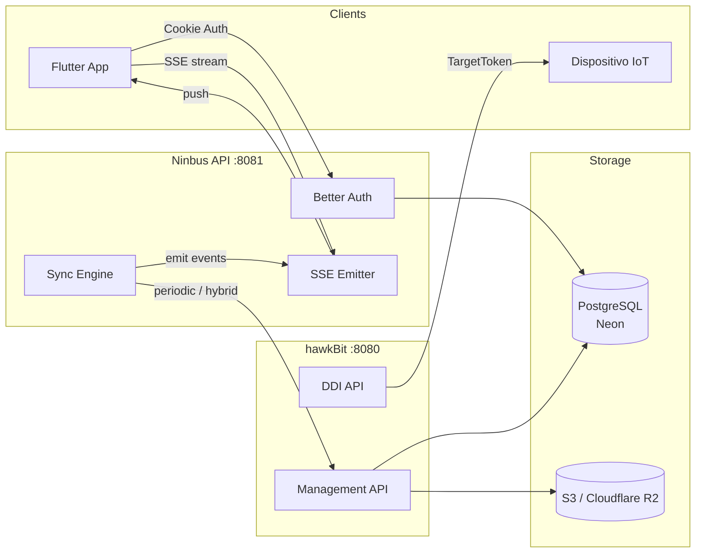
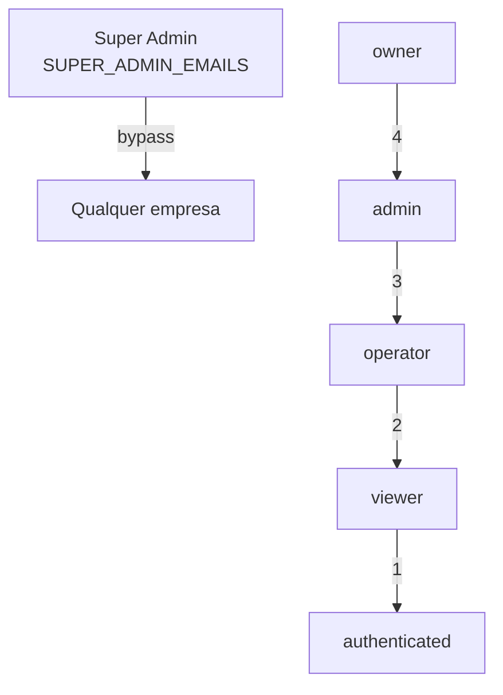
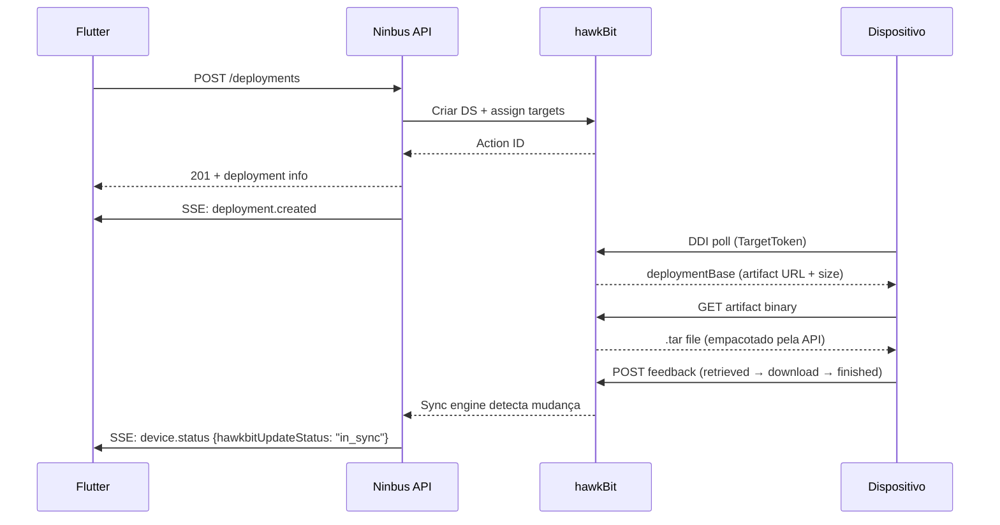
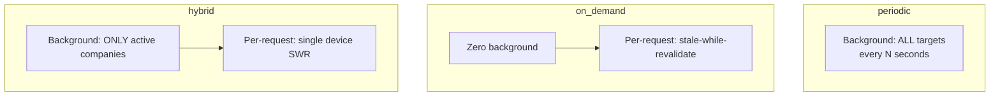
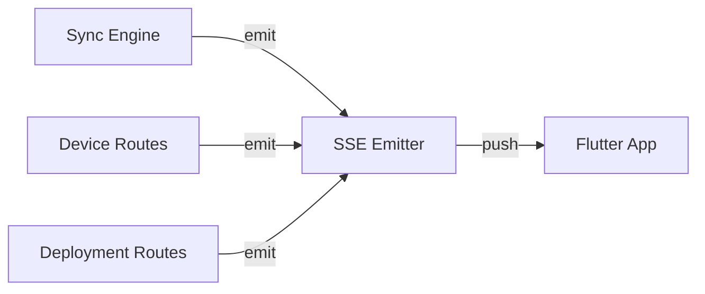
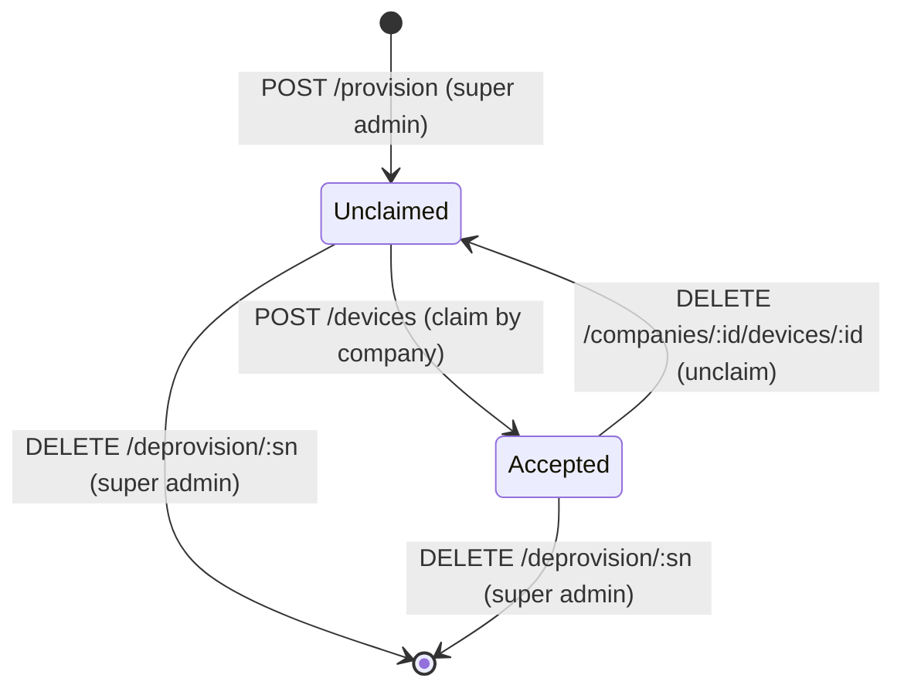

# Ninbus API

Plataforma OTA para gerenciamento de frotas IoT — provisioning, firmware upload, deployment e monitoramento em tempo real.

**Stack:** Bun · Elysia · Better Auth · Drizzle ORM · Eclipse hawkBit 1.0.3

---

## Arquitetura



**Fluxo de dados:**

1. **Flutter** → Ninbus API (cookie auth) → hawkBit Management API (Basic Auth)
2. **Sync Engine** → hawkBit → DB local (background) → SSE → Flutter (real-time)
3. **Dispositivo** → hawkBit DDI (TargetToken) → download firmware → feedback

---

## Quick Start

```bash
# Local development
bun install
cp .env.example .env          # fill required values
bun run db:push
bun run dev                    # → http://localhost:8081

# Docker (API + hawkBit)
docker compose build
docker compose up -d
docker compose logs -f api

# Tests (separate .env.test DB)
bun test --env-file=.env.test
```

---

## Serviços Docker

| Serviço | Porta | Descrição |
|---------|-------|-----------|
| `api` | 8081 | Ninbus API |
| `hawkbit` | 8080 | hawkBit Update Server 1.0.3 (custom build com S3 extension) |

> Armazenamento de artefatos: AWS S3 ou Cloudflare R2 (configurável via env). Sem serviço MinIO local.

```bash
docker compose up -d          # all services
docker compose up -d api      # API only (hawkBit must be running)
docker compose build api      # rebuild after code changes
docker compose down -v        # stop + remove volumes
```

> **Nota:** `docker compose` lê `.env` por padrão. Use `--env-file .env.docker` para overrides.

---

## Rotas

> Documentação interativa: `http://localhost:8081/docs`

### Auth — `POST /api/auth/*`

| Rota | Descrição |
|------|-----------|
| `/sign-up/email` | Registro |
| `/sign-in/email` | Login → cookie session |
| `/sign-out` | Logout |
| `/get-session` | Sessão atual |
| `/request-password-reset` | Solicitar reset de senha |
| `/reset-password` | Resetar senha |

### Provisioning — `/api/devices/*` (super admin only)

| Rota | Descrição |
|------|-----------|
| `POST /provision` | Registrar device + criar hawkBit target |
| `GET /unclaimed` | Devices sem empresa |
| `POST /sync` | Descobrir auto-provisionados |
| `GET /search?serialNumber=` | Buscar por serial |
| `DELETE /deprovision/:serialNumber` | Remover permanentemente |

### Empresas — `/api/companies/*`

| Rota | Role min. | Descrição |
|------|-----------|-----------|
| `GET /` | auth | Listar do usuário |
| `POST /` | auth | Criar (user vira owner) |
| `GET /:companyId` | viewer | Detalhes |
| `PUT /:companyId` | admin | Atualizar |
| `DELETE /:companyId` | owner | Remover |

### Membros — `/api/companies/:companyId/members/*`

| Rota | Role min. | Descrição |
|------|-----------|-----------|
| `GET /` | viewer | Listar membros |
| `POST /` | admin | Adicionar membro |
| `PUT /:userId` | admin | Alterar role |
| `DELETE /:userId` | admin | Remover membro |

### Categorias — `/api/companies/:companyId/categories/*`

| Rota | Role min. | Descrição |
|------|-----------|-----------|
| `GET /` | viewer | Listar |
| `POST /` | operator | Criar |
| `DELETE /:categoryId` | admin | Remover |

### Dispositivos — `/api/companies/:companyId/devices/*`

| Rota | Role min. | Descrição |
|------|-----------|-----------|
| `GET /` | viewer | Listar (DB local, zero hawkBit calls) |
| `POST /` | operator | Claim device |
| `GET /:deviceId` | viewer | Detalhes (stale-while-revalidate) |
| `PUT /:deviceId` | operator | Atualizar metadados |
| `DELETE /:deviceId` | admin | Unclaim (hawkBit target preservado) |
| `PUT /:deviceId/link` | operator | Vincular ao hawkBit manualmente |
| `GET /:deviceId/ddi-check` | viewer | Diagnóstico DDI do device |
| `GET /:deviceId/attributes` | viewer | Atributos hawkBit do target |
| `GET /:deviceId/actions` | viewer | Ações de deployment do device |
| `DELETE /:deviceId/actions/:actionId` | operator | Cancelar ação |
| `GET /:deviceId/categories` | viewer | Categorias do device |
| `PUT /:deviceId/categories` | operator | Atribuir categorias ao device |

### Deployments — `/api/companies/:companyId/deployments/*`

| Rota | Role min. | Descrição |
|------|-----------|-----------|
| `GET /artifact-types` | viewer | Tipos de artefato disponíveis |
| `POST /` | operator | Criar deployment OTA |
| `GET /` | viewer | Listar deployments (Distribution Sets) |
| `GET /:deploymentId` | viewer | Detalhes com status real |
| `DELETE /:deploymentId` | admin | Remover (cancela ações ativas) |
| `GET /:deploymentId/statistics` | viewer | Estatísticas hawkBit |
| `GET /:deploymentId/target-statuses` | viewer | Devices com fase + progresso enriquecidos |
| `GET /:deploymentId/targets` | viewer | Targets brutos do Distribution Set |
| `GET /:deploymentId/targets/:targetId/status-trail` | viewer | Timeline de status do device |
| `GET /:deploymentId/targets/:targetId/actions/:actionId/status` | viewer | Histórico raw de action status |
| `DELETE /:deploymentId/targets/:targetId/actions/:actionId` | operator | Cancelar ação por device |
| `GET /:deploymentId/ddi-check/:targetId` | viewer | Diagnóstico DDI: target receberia deploymentBase? |
| `GET /devices/:deviceId/actions` | viewer | Histórico de deployments do device |

### Artefatos — `/api/companies/:companyId/artifacts/*`

| Rota | Role min. | Descrição |
|------|-----------|-----------|
| `POST /` | operator | Upload firmware (.fir/.frz/.bin) |
| `GET /types` | viewer | Tipos de artefato |
| `GET /` | viewer | Listar (com size + hashes) |
| `GET /:artifactId` | viewer | Detalhes |
| `GET /:artifactId/download` | viewer | Info de download |
| `PUT /:artifactId` | operator | Atualizar metadados |
| `DELETE /:artifactId` | admin | Remover |

### SSE — `/api/sse/*` e `/api/companies/:companyId/sse`

| Rota | Descrição |
|------|-----------|
| `GET /companies/:companyId/sse` | SSE stream (company-scoped) |
| `GET /sse/global` | SSE stream (all events, super admin) |
| `POST /sse/test/:companyId` | Enviar evento de teste |
| `POST /sse/simulate/:companyId` | Simular stream de eventos |
| `GET /sse/debug/connections` | Debug: conexões ativas |

### Health — `/health`

| Rota | Descrição |
|------|-----------|
| `GET /health` | Health check (DB + sync state) |

---

## RBAC



| Role | Ler | Criar | Editar | Deletar |
|------|-----|-------|--------|---------|
| owner | ✅ | ✅ | ✅ | ✅ |
| admin | ✅ | ✅ | ✅ | ✅ |
| operator | ✅ | ✅ | ✅ | ❌ |
| viewer | ✅ | ❌ | ❌ | ❌ |

> **Super admin** (via `SUPER_ADMIN_EMAILS` env var): bypassa membership. Vê todas as empresas, não precisa ser membro. Recebe role implícita de `owner` em qualquer company-scoped endpoint.

---

## hawkBit — Integração

### Conceitos

| hawkBit | Ninbus | Uso |
|---------|--------|-----|
| Target | Device | `controllerId` = serial number hex |
| Software Module | Artifact | Container tipado (firmware, config) |
| Distribution Set | Deployment | Agrupa SMs, atribuído a targets |
| Action | Status por target | running → retrieved → downloading → finished |
| DDI | Device polling | `GET /{tenant}/controller/v1/{controllerId}` |

### Ciclo de Deployment



### Formato do Artefato (Device-side)

O firmware é empacotado em `.tar` pela API antes do upload ao hawkBit:

```
├── header-info/
│   └── featureidentity.json    {"type": "configuration-nfx"}
└── data/
    └── payload.bin             firmware raw (.frz / .fir / .bin)
```

O campo `size` no DDI deploymentBase = tamanho total do `.tar`. O tamanho do firmware real está no tar header no offset 1024+124 (12 bytes, octal).

### Cancel Flow

hawkBit requer **two-step** para cancelar uma action:
1. `DELETE /actions/{id}` → type muda para "cancel", status = "canceling"
2. `DELETE /actions/{id}?force=true` → status = "canceled"

Step 2 **só funciona** após step 1. Para actions já tipo "cancel", usar force direto.

---

## Sync Engine

O sync engine sincroniza hawkBit → DB local. Três modos:



| Modo | Background | On-demand | Recomendado para |
|------|-----------|-----------|-----------------|
| `periodic` | ALL targets a cada Ns | — | <1k devices |
| `on_demand` | nenhum | por request (cache 60s) | debug / dev |
| `hybrid` | companies com sessões ativas | single device (cache 60s) | **produção (50k+)** |

**Variáveis:**

| Variável | Default | Descrição |
|----------|---------|-----------|
| `HAWKBIT_SYNC_MODE` | `hybrid` | Estratégia de sync |
| `HAWKBIT_SYNC_INTERVAL_SEC` | 30 | Intervalo do background sync |
| `HAWKBIT_SYNC_STALE_SEC` | 60 | Threshold stale para on-demand |
| `HAWKBIT_SYNC_ACTIVE_WINDOW_SEC` | 300 | Janela para considerar empresa "ativa" |

**GET /devices faz ZERO chamadas hawkBit** — tudo vem do DB local atualizado pelo sync.

---

## SSE — Real-Time Events



### Eventos

| Evento | Dados | Quando |
|--------|-------|--------|
| `connected` | companyId, timestamp | Conexão estabelecida |
| `heartbeat` | timestamp | A cada 30s |
| `device.status` | deviceId, connectionStatus, hawkbitUpdateStatus, lastPollAt, ipAddress | Sync atualiza device |
| `device.deployment` | deviceId, controllerId, status, message, timestamp | Target recebe deployment |
| `device.claimed` | deviceId | POST /devices claim |
| `device.unclaimed` | deviceId | DELETE device (unclaim) |
| `deployment.created` | deploymentId, name, artifactType | POST /deployments |
| `deployment.deleted` | deploymentId | DELETE /deployments |
| `devices.batch` | count | Sync cycle completo |
| `test` | message, triggeredBy | POST /sse/test/:companyId |

### Endpoints

| Endpoint | Auth | Descrição |
|----------|------|-----------|
| `GET /api/companies/:companyId/sse` | viewer | SSE company-scoped |
| `GET /api/sse/global` | auth | SSE global (super admin) |
| `POST /api/sse/test/:companyId` | viewer | Dispara evento teste |
| `POST /api/sse/simulate/:companyId` | viewer | Simula stream de eventos |
| `GET /api/sse/debug/connections` | auth | Conexões ativas |

---

## Device Lifecycle



| Ação | Quem | hawkBit Target | DB Record |
|------|------|---------------|-----------|
| Provision | super admin | **criado** | **criado** (unclaimed) |
| Claim | company member | preservado | companyId set |
| Unclaim | admin | **preservado** | companyId = null |
| Deprovision | super admin | **deletado** | **deletado** |

---

## Tipos de Artefato

| Tipo | Destino | Risco | Reboot | Extensões |
|------|---------|-------|--------|-----------|
| `firmware-ninbus` | STM32F407 (NAND) | 🔴 HIGH | ✅ | `.fir` `.bin` |
| `firmware-controller` | LightDot (CAN) | 🟡 MED | ❌ | `.fir` `.bin` |
| `configuration-nfx` | NFX (NAND→CAN) | 🟢 LOW | ❌ | `.frz` `.nfx` |

---

## Configuração

Copie `.env.example` para `.env`. Todas as variáveis são validadas no startup via TypeBox.

### Obrigatórias

| Variável | Descrição |
|----------|-----------|
| `DATABASE_URL` | PostgreSQL (Neon recomendado) |
| `BETTER_AUTH_SECRET` | Secret para sessões (min 32 chars) |
| `BETTER_AUTH_URL` | URL base da API |

### hawkBit

| Variável | Default | Descrição |
|----------|---------|-----------|
| `HAWKBIT_ENABLED` | false | Ativa integração hawkBit |
| `HAWKBIT_URL` | — | Management API URL |
| `HAWKBIT_USERNAME` | — | Basic Auth user |
| `HAWKBIT_PASSWORD` | — | Basic Auth password |
| `HAWKBIT_TIMEOUT_MS` | 30000 | Request timeout |
| `HAWKBIT_SKIP_TLS` | false | Skip TLS verification |
| `HAWKBIT_AUTOPROVISIONING` | false | Auto-criar targets no DDI poll |

### hawkBit Sync Engine

| Variável | Default | Descrição |
|----------|---------|-----------|
| `HAWKBIT_SYNC_MODE` | hybrid | Estratégia (periodic/on_demand/hybrid) |
| `HAWKBIT_SYNC_INTERVAL_SEC` | 30 | Intervalo do background sync |
| `HAWKBIT_SYNC_STALE_SEC` | 60 | Threshold stale para on-demand |
| `HAWKBIT_SYNC_ACTIVE_WINDOW_SEC` | 300 | Janela para empresa "ativa" |

### hawkBit S3 / CDN

| Variável | Default | Descrição |
|----------|---------|-----------|
| `HAWKBIT_S3_ENABLED` | false | Usa S3/R2 para armazenar artefatos |
| `S3_ENDPOINT` | — | S3 endpoint (vazio = AWS default) |
| `S3_REGION` | — | Região S3 |
| `S3_ACCESS_KEY` | — | Access key |
| `S3_SECRET_KEY` | — | Secret key |
| `S3_BUCKET` | ninbus-artifacts | Bucket name |
| `HAWKBIT_CDN_BASE_URL` | — | CDN URL (CloudFront ou R2) |
| `HAWKBIT_CDN_KEY_PAIR_ID` | — | CloudFront Key Pair ID (Mode A) |
| `HAWKBIT_CDN_PRIVATE_KEY_PATH` | — | CloudFront RSA private key path |
| `HAWKBIT_CDN_EXPIRY_SEC` | 3600 | CDN URL expiry |

### SSE

| Variável | Default | Descrição |
|----------|---------|-----------|
| `SSE_ENABLED` | true | Ativa SSE endpoints |
| `SSE_HEARTBEAT_SEC` | 30 | Intervalo heartbeat |
| `SSE_MAX_CONNECTIONS_PER_COMPANY` | 50 | Limite por empresa |

### Opcionais

| Variável | Default | Descrição |
|----------|---------|-----------|
| `PORT` | 3000 | Porta do servidor |
| `HOST` | 0.0.0.0 | Host bind |
| `NODE_ENV` | development | environment |
| `LOG_LEVEL` | info | fatal/error/warn/info/debug/trace |
| `CORS_ORIGIN` | — | Origins separadas por vírgula |
| `SUPER_ADMIN_EMAILS` | — | Platform admins (vírgula) |
| `ENABLE_AUTH` | true | Habilita autenticação |
| `REQUIRE_EMAIL_VERIFICATION` | false | Exige verificação de email |
| `EMAIL_FROM` | noreply@example.com | Remetente de email |
| `RESEND_API_KEY` | — | Resend API key (email) |
| `ENABLE_RATE_LIMITER` | true | Rate limiting global |

---

## Estrutura do Projeto

```
src/
├── index.ts                         # Entry + graceful shutdown
├── app.ts                           # Composition root (modules + middleware + error handling)
├── common/
│   ├── config/                      # env.ts · hawkbit.ts · auth.ts · auth-client.ts · email.ts
│   ├── db/schema/                   # Drizzle tables (auth · companies · categories · devices · posts)
│   ├── hawkbit/                     # Client split by domain
│   │   ├── client.ts                # Barrel re-export + utility functions
│   │   ├── http.ts                  # HTTP infrastructure + error class
│   │   ├── targets.ts               # Target CRUD + actions + attributes
│   │   ├── distribution-sets.ts     # DS CRUD + assignment + statistics
│   │   ├── software-modules.ts      # SM CRUD + types + artifact upload
│   │   ├── constants.ts             # Artifact types + device type
│   │   └── types.ts                 # hawkBit API DTOs
│   ├── middleware/                  # auth-guard · company-guard · company-check · rate-limiter · request-logger
│   ├── schemas/                     # ErrorResponse · GenericActionResponse
│   ├── sse/                         # emitter.ts (W3C, company-scoped, heartbeat) + index.ts
│   ├── types/                       # deployment-status.ts + deployment-status-helpers.ts
│   ├── utils/                       # serial-number.ts
│   ├── logger/                      # Pino (JSON em prod, pino-pretty em dev)
│   └── swagger-config.ts           # OpenAPI/Scalar configuration
├── modules/
│   ├── auth/                        # Better Auth (sign-up · sign-in · sign-out · password reset)
│   ├── companies/                   # Multi-tenancy (index.ts + member-routes.ts)
│   ├── categories/                  # Device grouping (CRUD)
│   ├── devices/                     # Registry + provisioning + sync engine
│   │   ├── index.ts                 # CRUD routes (list · claim · get · update · delete · link)
│   │   ├── hawkbit-routes.ts        # hawkBit ops (attributes · actions · ddi-check)
│   │   ├── category-routes.ts       # Device ↔ category assignment
│   │   ├── provision-routes.ts      # Provisioning (super admin: provision · unclaimed · sync · deprovision)
│   │   ├── provisioning.ts          # Provision/unclaim/deprovision logic
│   │   ├── service.ts               # Business logic + hawkBit calls
│   │   ├── auth.ts                  # Device auth helpers
│   │   ├── schemas.ts               # Body/param/response schemas
│   │   ├── sync.ts                  # Engine orchestrator (<150 lines)
│   │   ├── sync-core.ts             # Types · status protection · single-device sync
│   │   ├── sync-fetch.ts            # Paginated hawkBit target queries
│   │   ├── sync-helpers.ts          # Batch DB ops · on-demand sync · re-exports
│   │   └── sync-strategies.ts       # Periodic · hybrid · SSE emission
│   ├── deployments/                 # OTA via hawkBit Distribution Sets
│   │   ├── index.ts                 # Create · list · get · delete
│   │   ├── device-routes.ts         # Statistics · targets · actions · trail · ddi-check
│   │   ├── service.ts               # Deployment business logic
│   │   ├── schemas.ts               # All deployment schemas
│   │   ├── actions.ts               # Action management (cancel · force-close)
│   │   ├── enrichment.ts            # Status computation + hawkBit statistics
│   │   ├── helpers.ts               # Shared deployment helpers
│   │   ├── trail.ts                 # Target status trail (timeline)
│   │   ├── trail-schemas.ts         # Trail-specific schemas
│   │   ├── ddi-diagnostics.ts       # DDI readiness check logic
│   │   └── deployment.test.ts       # Unit tests (71 tests, 95 assertions)
│   ├── artifacts/                   # Firmware upload via hawkBit Software Modules
│   │   ├── index.ts                 # Upload + types
│   │   ├── manage-routes.ts         # List · get · update · delete · download
│   │   ├── service.ts               # Upload + enrichment + tar packaging
│   │   ├── schemas.ts               # Artifact schemas
│   │   └── tar-packager.ts          # .tar archive generator for embedded device
│   ├── sse/                         # SSE routes (index.ts + test-routes.ts)
│   ├── health/                      # GET /health (DB + sync state)
│   └── posts/                       # CRUD reference implementation
├── scripts/
│   ├── migrate.ts                   # Startup migrations
│   ├── seed.ts                      # DB seed
│   └── sse-test-simulation.ts       # SSE E2E test
└── tests/                           # Integration tests (174 it() · 272 expect())
    ├── artifacts.test.ts            # 20 tests
    ├── auth.test.ts                 # 27 tests
    ├── categories.test.ts           # 12 tests
    ├── companies.test.ts            # 13 tests
    ├── deployments.test.ts          # 27 tests
    ├── devices.test.ts              # 25 tests
    ├── health.test.ts               # 5 tests
    ├── posts.test.ts                # 24 tests
    ├── provisioning.test.ts         # 17 tests
    └── sse.test.ts                  # 4 tests
```

---

## Scripts

| Comando | Descrição |
|---------|-----------|
| `bun run dev` | Dev com hot reload |
| `bun run build` | Build produção (single bundle) |
| `bun run start` | Iniciar produção |
| `bun run db:push` | Push schema para o DB |
| `bun run db:migrate` | Migrations |
| `bun run db:studio` | Drizzle Studio |
| `bun run db:generate` | Gerar migration files |
| `bun run db:seed` | Popular DB com seed data |
| `bun test` | Rodar testes |
| `bun run lint` | Biome linter |
| `bun run lint:fix` | Biome auto-fix |
| `bun run format` | Biome formatter |
| `bun run docker:build` | Build Docker image |
| `bun run docker:up` | Docker compose up |
| `bun run docker:down` | Docker compose down |
| `bun run docker:logs` | Docker compose logs |

---

## Stack

[Bun](https://bun.sh) · [Elysia](https://elysiajs.com) · [Better Auth](https://better-auth.com) · [Drizzle](https://orm.drizzle.team) · [TypeBox](https://github.com/sinclairtypebox) · [hawkBit](https://eclipse.org/hawkbit/) · [Scalar](https://scalar.com)

## Licença

Proprietário — Ninbus Tecnologia.
